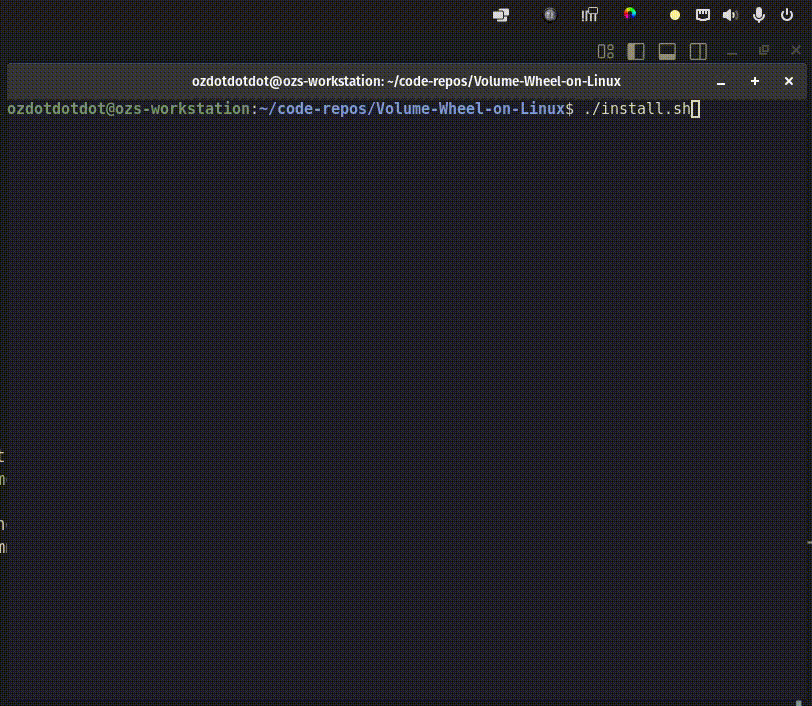

# Volume Wheel on Linux

A small helper that lets you hold a modifier (for example Left Alt) and use the mouse wheel to change the system volume. While the modifier is pressed the helper suppresses wheel events so foreground apps do not scroll, and it forwards other mouse activity through an injected virtual device so your desktop keeps working as expected.



_Volume OSD opened in the top-right purely for the demo; the helper works without keeping the mixer open._

## Features

- Hold a keyboard key or extra mouse button and scroll to adjust volume in 5% steps (configurable).
- Detects the best available PipeWire/PulseAudio/ALSA CLI (`wpctl`, `pactl`, `amixer`).
- Suppresses scroll ticks while the modifier is held.
- Optional support for extra mouse interfaces that emit the modifier (e.g. Logitech G-series auxiliary buttons).
- Systemd user service for automatic start on login.

## Requirements

- Linux with `/dev/input` access and the `uinput` kernel module.
- Python 3.9+ with the [`evdev`](https://python-evdev.readthedocs.io/) package (`pip install --user evdev`).
- Ability to run `sudo` during installation (writes udev/hwdb rules and loads `uinput`).

## Quick Start

```bash
git clone https://github.com/ozdotdotdot/Volume-Wheel-on-Linux.git
cd Volume-Wheel-on-Linux
./install.sh
```

The installer will:

1. Let you pick the mouse and keyboard devices from `/dev/input/by-id`.
2. Offer detected auxiliary interfaces (e.g. `-if01-event-kbd`) that also emit Alt when you press a mouse button.
3. Install `/etc/udev/hwdb.d/90-volume-wheel.hwdb` and `/etc/udev/rules.d/90-volume-wheel.rules` so the virtual device inherits the same identifiers as your physical mouse.
4. Ensure `uinput` loads at boot and add your user to the `input` group (you may need to log out/in once).
5. Create `~/.config/systemd/user/volume-wheel.service` and optionally start it immediately.

### Manual Usage

You can run the helper directly without the service:

```bash
python3 Volume-wheel \
  --mouse /dev/input/by-id/usb-Logitech_Gaming_Mouse_G502_XXXXXXXX-event-mouse \
  --keyboard /dev/input/by-id/usb-Razer_Razer_Huntsman-event-kbd \
  --extra-devices /dev/input/by-id/usb-Logitech_Gaming_Mouse_G502_XXXXXXXX-if01-event-kbd \
  --volume-step 5%
```

The `--extra-devices` flag accepts a colon-separated list. Device paths can also be provided through environment variables (`VOLUME_WHEEL_MOUSE_PATH`, `VOLUME_WHEEL_KEYBOARD_PATH`, `VOLUME_WHEEL_EXTRA_PATHS`, `VOLUME_WHEEL_STEP`).

## Configuration

- **Modifier source** – by default Left Alt is recognised from both the keyboard and any devices listed in `MOUSE_ALT_BUTTON_CODES`. You can edit `Volume-wheel` to add or remove button codes (see `MOUSE_ALT_BUTTON_CODES` and `ALT_KEY_CODES`).
- **Volume step** – set `VOLUME_WHEEL_STEP=2%` (or use `--volume-step`) to change the percentage applied on each wheel tick.
- **Service location** – the systemd unit lives in `~/.config/systemd/user/volume-wheel.service`. Disable it with `systemctl --user disable --now volume-wheel.service` if you want to manage the helper manually.

## Development Notes

- The script expects to run with permission to grab the selected mouse device. If it cannot grab, it still changes volume but scroll suppression will not be global.
- When running from source, remember to stop the systemd service first to avoid two instances competing for `/dev/input` access.

## Known Issues

- **Pointer acceleration jump on some desktops** – certain environments (notably GNOME on Wayland) may still apply a different acceleration curve when the virtual mouse is active. If you notice the cursor speeding up while the modifier is held, you can work around it by running the helper with pointer forwarding disabled: start the script with `--no-forward-pointer` (or set `VOLUME_WHEEL_NO_FORWARD_POINTER=1` in the systemd unit). This freezes pointer movement while Alt is down but keeps wheel suppression and volume control intact.

Contributions to improve the udev/libinput alignment are welcome.
